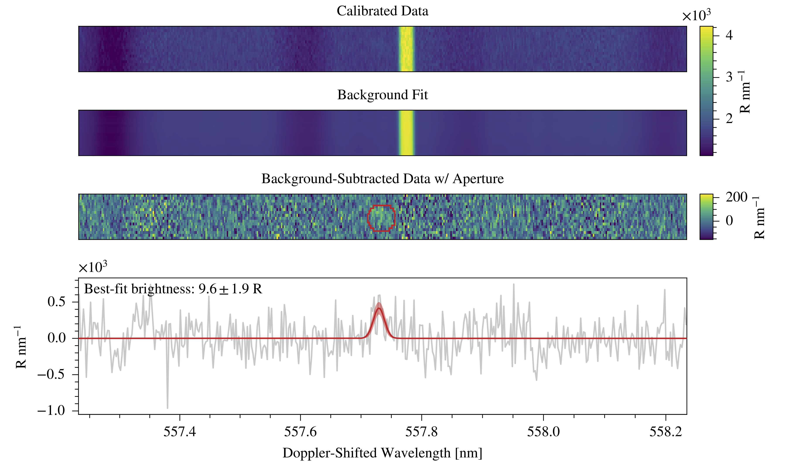
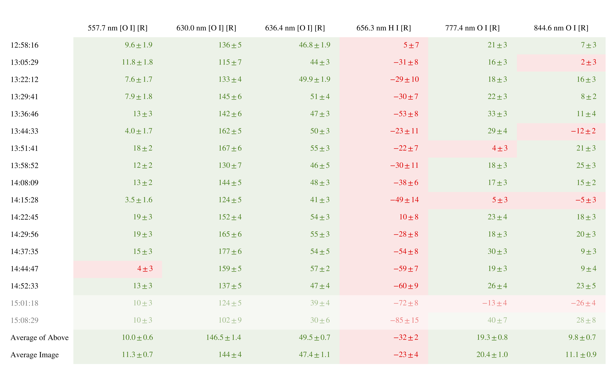

# `hiresaurora`: (Somewhat) Automated Galilean Satellite Eclipse Aurora Brightness Calculations

## Introduction
This package automates the calculation of in-eclipse aurora brightnesses for 
Keck/HIRES observations of the Galilean satellites. Examples of these types
of observations include de Kleer et al. (2018)[^1], de Kleer et al. (2023)[^2], 
Schmidt et al. (2023)[^3] and Milby et al. (2024)[^4].

There are two accessible utilities: an eclipse-prediction tool and the 
brightness-retrieval tool.

> **NOTE**<br>
> Brightness retrieval requires data reduced using the `hirespipeline` package,
> also available on my Github page.

[^1]: https://doi.org/10.3847/1538-3881/aadae8
[^2]: https://doi.org/10.3847/PSJ/acb53c
[^3]: https://doi.org/10.3847/PSJ/ac85b0
[^4]: https://doi.org/10.3847/PSJ/ad49a2

## Installation
I'm assuming you've already created a virtual environment and installed the
`hirespipeline` package, also available on my Github page. The steps are the
same as installing that package:
1. Activate your virtual environment:<br>
    `% conda activate hires_reduction`
2. Install the `hiresaurora` package and its dependencies:<br>
    `% python -m pip install git+https://github.com/zachariahmilby/keck-hires-aurora.git`


## Available Auroral Emissions
To see which lines are currently available, try the following:
```
>>> from hiresaurora import AuroraLines
>>> lines = AuroraLines(extended=True)
>>> print(lines)
Aurora lines (extended set):
   342.7 nm [Na I]
   364.9 nm [K I]
   372.6 nm [O II]
   372.9 nm [O II]
   388.4 nm [Na I]
   406.9 nm [S II]
   407.6 nm [S II]
   434.0 nm H I
   458.9 nm [S I]
   462.2 nm [C I]
   462.7 nm [C I]
   464.2 nm [K I]
   486.1 nm H I
   557.7 nm [O I]
   589.0 nm Na I
   589.6 nm Na I
   630.0 nm [O I]
   636.4 nm [O I]
   656.3 nm H I
   671.6 nm [S II]
   673.1 nm [S II]
   732.0 nm [O II]
   733.0 nm [O II]
   751.5 nm [Na I]
   766.4 nm K I
   769.9 nm K I
   772.5 nm [S I]
   777.4 nm O I
   818.3 nm Na I
   819.5 nm Na I
   837.6 nm Cl I
   844.6 nm O I
   872.7 nm [C I]
   922.3 nm S I
```
This is the full set appropriate for targets like Io. For the icy satellites, 
you can use `extended=False` to get the following set:
```
Aurora lines:
   557.7 nm [O I]
   630.0 nm [O I]
   636.4 nm [O I]
   656.3 nm H I
   777.4 nm O I
   844.6 nm O I
```
> **CAUTION**<br>
> These are all the lines the pipeline will search for, *not* necessarily all 
> the lines available given your choice of cross disperser and echelle and 
> cross-disperser angles.

## Running the Pipeline
Like the HIRES data reduction pipeline, the aurora calibration pipeline has 
just one method. To begin, simply import the class
```
>>> from hiresaurora import AuroraPipeline
```

The brightness retrieval is slightly less automated than the reduction 
pipeline, so you might need to run it a few times and adjust some parameters 
until you achieve a good result. I haven't yet been able to figure out a way to
automate this stage, since it's more of an art than a science.

First, setup the pipeline. The one required argument is 
`reduced_data_directory` which points to the `reduced` directory generated by
`HIRESPipeline`. The other optional keyword arguments are explained below:
- `fit_background`: Whether or not to calculate a best-fit background. Default 
   is `True`, but you can turn this off if you want. It will definitely speed 
   things up a bit.
- `extended`: Whether or not to use the full extended set of emission lines 
   appropriate to Io. Default is `False`. 
- `exclude_from_averaging`: List of indices of observations to exclude from 
   averaging. For instance, if the third observation had some sort of 
   systematic brightness issue or maybe the last few observations were overly
   contaminated by stray light from Jupiter, you can suppress them from 
   calculations of both the average spectrum and the averages of the individual
   results.
- `skip`: Lines to skip when calculating brightnesses. For example, passing the 
   list `['557.7 nm [O I]']` will skip calculating the 557.7 nm [O I] 
   brightnesses. Strings should be formatted as printed by `AuroraLines` (see 
   previous section). see the Default is `None`. 
- `systematic_trace_offset`: Additional vertical offset for the "trace" in all 
   images. To apply to all orders/wavelengths, pass an int or float. To apply 
   just to a single line, pass a dictionary where the key(s) are the specific
   lines to which you want to apply the offset. For the dictionary value you 
   can pass an int or float or a list of ints or floats. If you pass a list, it 
   should have the same length as the number of individual observations. For 
   example, if there are 3 observations and you want to systematically offset 
   the second trace downward by 3 bins for the 777.4 nm O I line, you would 
   pass `systematic_trace_offset={'777.4 nm O I': [0, -2, 0]}`. 
- `horizontal_offset`: A manual horizontal offset in spectral bins. Useful if 
   the wavelength solution is off or the Doppler shift is wrong. For now this 
   applies to all lines and cannot be specified like `systematic_trace_offset`. 
- `doppler_shift_background`: Whether or not to allow the background template 
   to Doppler shift. If the slit wasn't very long or the signal isn't very 
   strong, this might produce bad results and should be set to `False`. Default 
   is `True`. 
- `smooth`: List of specific lines for which the template background spectrum 
   should be smoothed before fitting. Smoothing the template may produce a 
   better background fit for some lines. You'll just have to experiment with 
   this.

To run the pipeline use the method `run()`. It has one required argument 
`aperture_radius`, which defines the aperture radius in arcsec. A typical value
is (2 ± 0.5) arcsec. You can start with one of these, run the pipeline, then 
evaluate the resulting quicklooks to see if the aperture (drawn in red) 
effectively captures the emission. The other optional arguments are 
`trim_bottom` and `trim_top`, which set the number of rows to remove from the
top and bottom of the 2D spectra before calculating and fitting the background 
template. The default is 2, which seems to work well most of the time. However,
if you run the pipeline and notice there are still rows which seem 
systematically different from the others, you may want to trim a few more.
Finally, `average_aperture_scale` allows you to increase the size of the 
aperture for the average spectrum in case the emission seems to be more 
spatially extended.

```
>>> pipeline = AuroraPipeline(
>>>    reduced_data_directory='/path/to/reduced')

>>> pipeline.run(
>>>    aperture_radius=2.25*u.arcsec,
>>>    trim_bottom=3,
>>>    trim_top=4,
>>>    average_aperture_scale=1.15)
```

You can find the calibrated data and calculated brightnesses in the 
`calibrated` directory in the same path as the `reduced` directory you pass to 
the `AuroraPipeline` class. Calibrated data are further sorted by each auroral 
wavelength. Within each wavelength, you'll find the calibrated data saved as
FITS files along with quicklook products. The quicklook graphic shows the "raw"
data, the best-fit background, the background-subtracted data with the target
aperture drawn in red, and the 1D spectrum calculated from the rows containing
the aperture. The 1D spectrum includes the best-fit Gaussian line model for the
given emission line in red and the uncertainty in the fit as the shaded red 
region. Here's an example of a quicklook:



>**NOTE**<br>
> Even though the average brightness in the two-dimensional images should be 
> equal to the retrieved brightness, the images appear dimmer (even the maximum 
> brightness in any pixel is less than the retrieved brightness). This is 
> because atmospheric seeing has spread out the signal. If it were all 
> contained within the apparent disk of the target, the average value would be 
> that of the retrieved brightness.

You will also find tabulated results for each observation and emission line in
both graphical and CSV format. For the graphical representation, lines with a
best-fit signal-to-noise greater than 2 are in green, less than 2 are in red 
and rows containing any excluded spectra (as selected using 
`exclude_from_averaging` when instantiating the `AuroraPipeline` class) are 
lighter. Here's an example of what one of the graphical tabular results tables
looks like:



## Calibration Data Sources
Jupiter's spectral reflectivity (I/F) comes from a digitized version of Woodman 
et al. (1979)[^5] figures 1 (for 600 through 1000 nm) and 6 (for 320 through 
600 nm). The values don't match at their common wavelengths, so I scaled the 
figure 6 curve to match the values of the figure 1 curve.

For the solar irradiance at Earth, I've used version 2 of the Total and 
Spectral Solar Irradiance Sensor-1 Hybrid Solar Reference Spectrum 
(TSIS-1 HSRS) in units of W/m<sup>2</sup>/nm.[^6]

[^5]: https://doi.org/10.1016/0019-1035(79)90116-7
[^6]: https://doi.org/10.1029/2022EA002637
