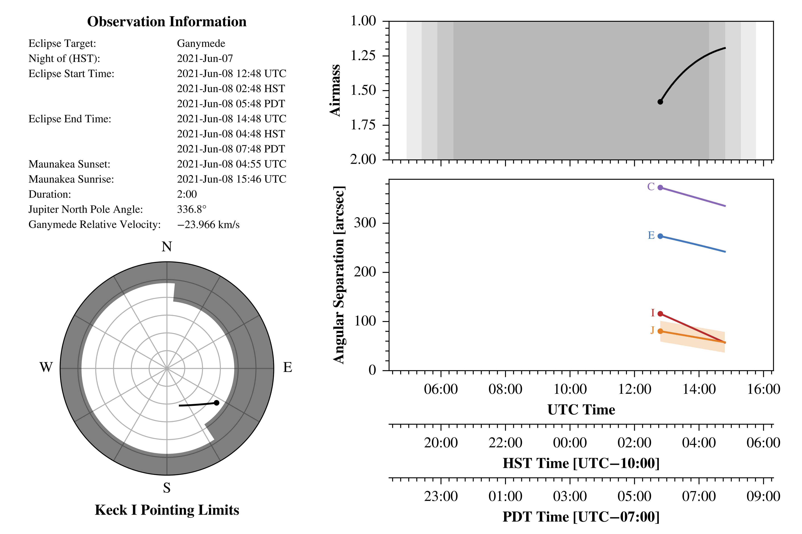

# `hiresaurora`: (Somewhat) Automated Galilean Satellite Eclipse Aurora Brightness Retrievals

## Introduction
This package automates the retrieval of in-eclipse aurora brightness retrievals
for Keck/HIRES observations of the Galilean satellites. Examples of these types
of observations include de Kleer et al. (2018)[^1], de Kleer et al. (2023)[^2] 
and Schmidt et al. (2023)[^3].

There are two accessible utilities: an eclipse-prediction tool and the 
brightness-retrieval tool.

> **NOTE**<br>
> Brightness retrieval requires data reduced using the `hirespipeline` package,
> also available on my Github page.

[^1]: https://doi.org/10.3847/1538-3881/aadae8
[^2]: https://doi.org/10.3847/PSJ/acb53c
[^3]: https://doi.org/10.3847/PSJ/ac85b0

## Installation
I'm assuming you've already created a virtual environment and installed the
`hirespipeline` package, also available on my Github page. The steps are the
same as installing that package:
1. Activate your virtual environment:<br>
    `% conda activate hires_reduction`
2. Install the `hiresaurora` package and its dependencies:<br>
    `% python -m pip install git+https://github.com/zachariahmilby/keck-hires-aurora.git`

## Predicting Eclipses
To find when eclipses occur (or to find out information about an eclipse you've 
already observed), import the `EclipsePrediction` class:

```>>> from hiresaurora import EclipsePrediction```

To predict eclipses, set a starting and ending date (`'YYYY-MM-DD HH:MM'` 
format, time optional) and a target satellite (`'Io'`, `'Europa'`, `'Ganymede'` 
or `'Callisto'`). You might get an error from Horizons saying your target name
is too ambiguous:
`ValueError: Ambiguous target name; provide unique id`, followed by a list 
of potential alternatives. I found this happened with Io and Europa. For these 
satellites, you can just enter the object ID#: 501 for Io and 502 for Europa. 
There's also an option to set a minimum relative velocity (in km/s) using the 
keyword `minimum_deltav`. The default is 12.6 km/s, which shifts 557.7 nm by 
one slit from the Earth airglow. However, ideally I think you'd want a bit
more, maybe a shift of 1.5 slit widths, in which case the minimum would be 
19 km/s. Depending on the timespan you've specified, it may take a minute or 
two to run. For example, if you want to predict Ganymede eclipses from June 1 
to September 1, 2021:

```
>>> eclipse_prediction = EclipsePrediction(starting_datetime='2021-06-01', ending_datetime='2021-09-01', target='Ganymede')

4 Ganymede eclipse(s) identified between 2021-06-01 and 2021-09-01.

Starting Time (Keck/UTC) Ending Time (Keck/UTC) Starting Time (California) Ending Time (California) Duration Airmass Range  Relative Velocity
2021-Jun-08 12:48        2021-Jun-08 15:17      2021-Jun-08 05:48 PDT      2021-Jun-08 08:17 PDT    2:29     1.173 to 1.581 -24.0 km/s       
2021-Jul-14 09:40        2021-Jul-14 12:06      2021-Jul-14 02:40 PDT      2021-Jul-14 05:06 PDT    2:26     1.222 to 1.994 -16.2 km/s       
2021-Jul-21 12:47        2021-Jul-21 15:29      2021-Jul-21 05:47 PDT      2021-Jul-21 08:29 PDT    2:42     1.181 to 1.670 -12.8 km/s       
2021-Aug-26 11:45        2021-Aug-26 12:15      2021-Aug-26 04:45 PDT      2021-Aug-26 05:15 PDT    0:30     1.359 to 1.481   2.6 km/s       
```

If you choose a time period without any eclipses (like January 1 to February 
1, 2021), you'll get an error message (but not an exception):

```
>>> eclipse_prediction = EclipsePrediction(starting_datetime='2021-01-01', ending_datetime='2021-02-01', target='Ganymede')
Sorry, no eclipses found!
```

`EclipsePrediction` has the method `save_summary_graphics()` which will save a 
small summary graphic to your computer. By default, they save in 
your current working directory. However, you can also specify the 
directory where you want the graphics saved by passing a string of the path or
a `pathlib.Path` object:

```
>>> eclipse_prediction.save_summary_graphics('/path/to/directory')
```

Here's an example of what one of those graphics looks like:



It includes the starting and ending times in local California time (so you know 
how awful of a night you'll have) and UTC, the closest sunrise and sunset times 
to the eclipse, the duration of the eclipse in HH:MM format, the rotation angle 
of Jupiter's north pole and Ganymede's relative velocity. The lower left 
graphic shows the position of the target satellite during the eclipse in 
altitude/azimuth coordinates with an overlay of the Keck I pointing limits. The 
upper right plot shows the target satellite airmass over the course of the 
eclipse. The lower right plot shows the angular separation between the target 
satellite, Jupiter and the other Galilean satellites.

I've also included the ability to automatically generate the list of offsets 
and rates for manual telescope pointing and tracking. For example, if you are 
using Io as the guide satellite:
```
>>> eclipse_prediction.save_pointing_offsets(guide_satellite='Io', save_directory='/path/to/directory')
```
This will save four files: two sets of RA/Dec offsets (from the guide satellite 
to the target and vice-versa) and two equivalent sets of RA/Dec rates, each
formatted with the name of the satellite you are slewing to and the 
properly-formatted terminal command. For example, for June 8, 2021, the first 
three lines of the offset file from Europa (the guide satellite) to Ganymede 
(the eclipse target) `offsets_Europa_to_Ganymede_2021-Jun-08.txt` are
```
Ganymede 12:48   en -257.868 -105.588
Ganymede 12:49   en -257.616 -105.444
Ganymede 12:50   en -257.400 -105.372
```
so simply match the closest UTC time on the telescope status window, then type
the command like `>>> en -257.868 -105.588`.

The rate file which goes with these offsets is 
`rates_Europa_to_Ganymede_2021-Jun-08.txt` and its first three lines look like
```
Ganymede 12:48   modify -s dcs dtrack=1 dra=0.000287388 ddec=0.001614987
Ganymede 12:49   modify -s dcs dtrack=1 dra=0.000287390 ddec=0.001615227
Ganymede 12:50   modify -s dcs dtrack=1 dra=0.000287392 ddec=0.001615467
```
so matching the same time with the offsets, the command would be something like
`>>> modify -s dcs dtrack=1 dra=0.000287388 ddec=0.001614987`.

## Retrieving Aurora Brightnesses

The function `run_retrieval` takes the reduced data, flux-calibrates
the science images and extracts the surface brightness in rayleigh at a variety 
of wavelengths (if the detector setup captured them):
1. [O I] 557.7 nm
2. [O I] 630.0 nm
3. [O I] 636.4 nm
4. O I 777.4 nm
5. O I 844.6 nm
6. H I 656.3 nm

These lines are appropriate for the icy Galilean satellites Europa, Ganymede 
and Callisto. For Io, there are additional lines available by setting the 
keyword `extended=True`:
7. Na I 589.3 nm
8. Na I 818.3 nm
9. Na I 819.5 nm
10. K I 766.4 nm
11. K I 769.9 nm
12. [S I] 772.5 nm
13. S I 921.3 nm
14. S I 922.8 nm
15. S I 923.8 nm
16. [O II] 731.9 nm
17. [O II] 733.0 nm
18. [S II] 671.6 nm
19. [S II] 673.1 nm

The brightness retrieval is slightly less automated than the reduction 
pipeline, so you may need to run it a few times and adjust some parameters 
until you achieve a good result. I haven't yet been able to figure out a way to
automate this stage, since it's more of an art than a science.

To run the retrieval:

```
>>> run_retrieval(
        reduced_data_directory='/path/to/reduced',
        extended=False, trim_bottom=2, trim_top=2, seeing=1,
        horizontal_offset=0
        )
```

The first argument is the path to the reduced data from the `hirespipeline` 
output. `extended` lets you choose whether or not to include the extended line 
list appropriate to Io. `trim_bottom` and `trim_top` are the number of rows to 
remove from the top and bottom of each order. Eliminating the sloping edges of 
the order massively improve the background fit. The default is 2, but I've 
often found it necessary to increase the number. They do not have to be the 
same number. `seeing` accounts for the spread of the signal beyond the actual 
physical size of the target satellite (in this case, the angular size). This 
argument lets you add to the radius of the target satellite to increase the 
size of the aperture with which you capture the brightness. The aperture has a 
size (𝘙 + seeing)² where 𝘙 is the apparent angular radius of the target
satellite. `horizontal_offset` lets you account for a slightly-off wavelength
solution by adjusting the aperture horizontally. The trace frames determine the
vertical offset for the individual frames and the geometric center of the order
determines the center for the average. I attempted to align each frame by their
centers, but the edge effects and the large variance of the center along the 
slit really messed up the background subtraction. I think this is the best 
solution for now. I may add alignment based on the trace frames at a later 
date.

You can find the retrieved brightnesses in the `brightness_retrievals` 
directory in the same path as the `reduced` directory you pass to the function.
Retrievals are further sorted by each wavelength. Within each wavelength, 
you'll find a `results.txt` file which includes the following columns:
1. `date`: the date at the start of the observation in ISOT format
2. `fitted_brightness_[R]`: the brightness of the Gaussian fit(s) in rayleighs
3. `fitted_uncertainty_[R]`: the uncertainty of the Gaussian fit(s) in 
   rayleighs
4. `measured_brightness_[R]`: the integrated brightness of the observed 
   spectrum in rayleighs
5. `measured_uncertainty_[R]`: the uncertainty of the integrated observed 
   spectrum in rayleighs

You'll also find images of the one-dimensional spectra with the Gaussian fits 
in the directory `spectra_1d` and calibrated images in rayleighs in the 
directory `images_2d`.
>**NOTE**<br>
> Even though the average brightness in the two-dimensional images should be 
> equal to the retrieved brightness, the images appear dimmer (even the maximum 
> brightness in any pixel is less than the retrieved brightness). This is 
> because atmospheric seeing has spread out the signal. If it were all 
> contained within the apparent disk of the target, the average value would be 
> that of the retrieved brightness.


## Calibration Data Sources
Jupiter's spectral reflectivity (I/F) comes from a digitized version of Woodman 
et al. (1979)[^5] figures 1 (for 600 through 1000 nm) and 6 (for 320 through 
600 nm). The values don't match at their common values, so I scaled the figure
6 curve to match the values of the figure 1 curve.

For the solar irradiance at Earth, I've used a theoretical solar spectral 
radiance above Earth's atmosphere at 1 au from the Sun in units of 
W/m<sup>2</sup>/nm The spectral irradiance data come from the 2000 ASTM 
Standard Extraterrestrial Spectrum Reference E-490-00.[^6]

[^5]: Woodman, J. H., et al. (1979), Spatially resolved reflectivities of 
      Jupiter during the 1976 opposition, Icarus, 37(1), 73-83, 
      doi:10.1016/0019-1035(79)90116-7
[^6]: https://www.nrel.gov/grid/solar-resource/spectra-astm-e490.html

